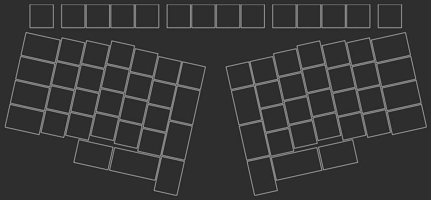

# Sundown keyboard

A custom keyboard with the following features:

- Choc keys (hotswap) with MX spacing
- Columnar staggered key layout
- Unsplit body design
- Wireless (Bluetooth) and USB-C
- White per-key lighting
- 72 keys, two rotary encoders
- OLED display (note that currently OLED support in QMK is experimental)
- Roughly 70% lyaout with number row and function keys

## TODO

- [x] Fix overlapping keys in Ergogen points
- [ ] Encoders in Ergogen for inner thumb keys
- [x] Overlays in Ergogen
- [x] PCBs in Ergogen
- [ ] Place screw holes etc in design
- [ ] Generate Kicad file with routing
- [ ] Leave a hole in the PCB for the battery

## Variants

* Max (F-keys and number row)
* Mini (number row but no F-keys)
* Micro-X (no number row or F-keys, split design)

## Parts needed for Sundown build

### All builds

* Main PCB
* USB-C internal extension cable
* Switches: x72
* Keycaps:
    * 1U x52
    * 1.25U x20
* Nice!nano
* Diodes
* LEDs: x72
* Hotswap sockets: x72
* Screws
* Standoffs
* Bottom plate
* Low-profile encoders x2
* Low-profile encoder knobs x2

### Standard build

* Top case (plastic/FR-4)

### Premium build

* Top case (aluminium)
* Nice!view screen
* LEDs
