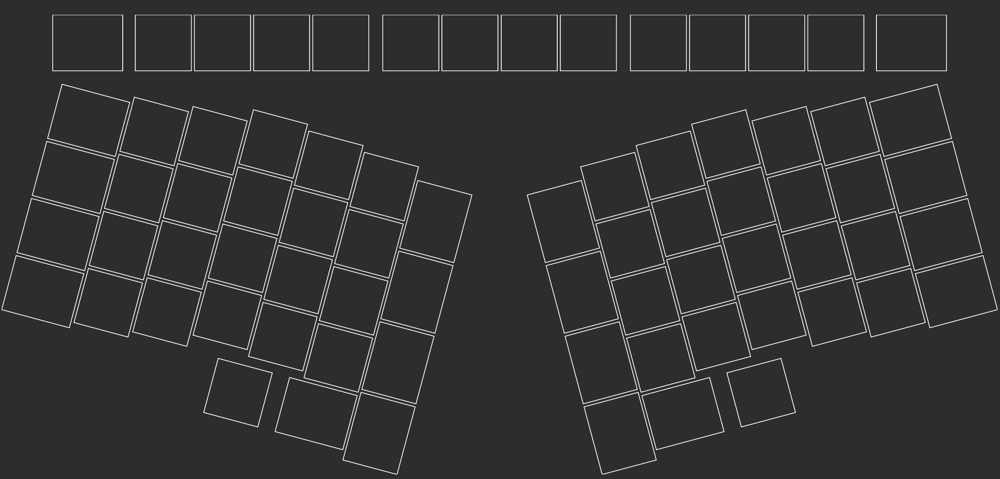

# Sundown keyboard

A custom keyboard with the following features:

* Columnar staggered key layout
* Semi-split design
* Wireless (Bluetooth) and USB-C
* White per-key lighting
* Two rotary encoders
* OLED display (note that currently OLED support in QMK is experimental)

